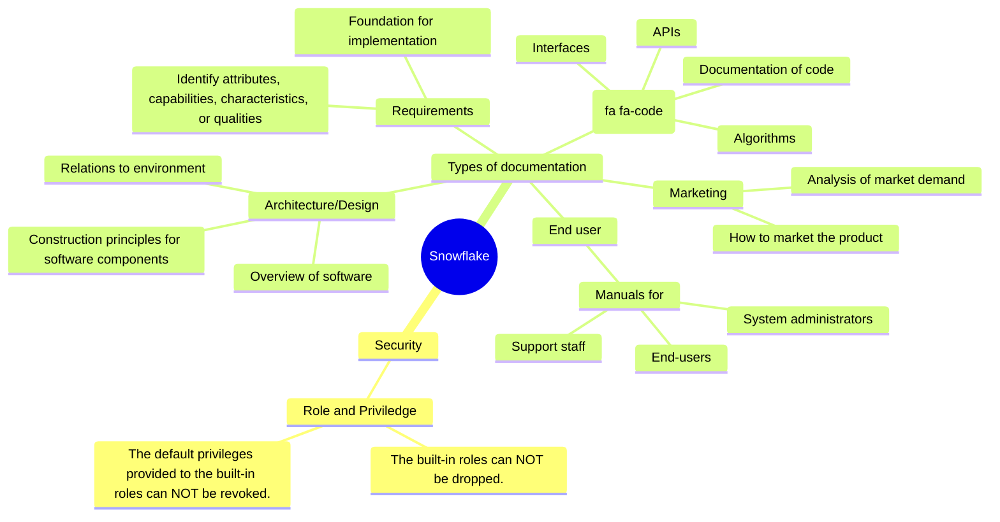

## Test2

* During the load process, the COPY command allows for modifying the order of columns, omitting one or more columns, casting data into specified data types, and truncating values. While loading the data, complex transformations such as joins, filters, aggregations, and the use of FLATTEN are not supported as they are not essential data transformations.
  **It is useful that in raw layer, we could perform this transformation**
* Data provided by the ACCOUNT_USAGE views is NOT real-time and refreshes typically with a lag of **45 minutes to 3 hours**
* The Enterprise edition has several additional capabilities not provided in the Standard edition. These include **multi-cluster virtual warehouses, column-level masking, row access policies, materialized views, and search optimization.**
* ACCOUNTADMIN is the only role with the privileges required to **create & manage a share** because managing Share is an account-level activity.
* The search optimization service in Snowflake is similar to the **secondary index** concept in typical databases.
* A cloned object does not inherit any privileges from its source object; for instance, a cloned table does not inherit any privileges from its source table. However, if a database or schema is cloned, privileges are inherited by the child objects.
* The following indicators can help determine if a clustering key may be needed. · The table has large volumes of data (e.g., multiple terabytes) · Queries on the table are running slower than expected. · Query performance has gotten worse over time. · The table has a large clustering depth
* Temporary tables can NOT be cloned to a permanent table. However, a temporary table may be cloned to a transient table or another temporary table.
* 

