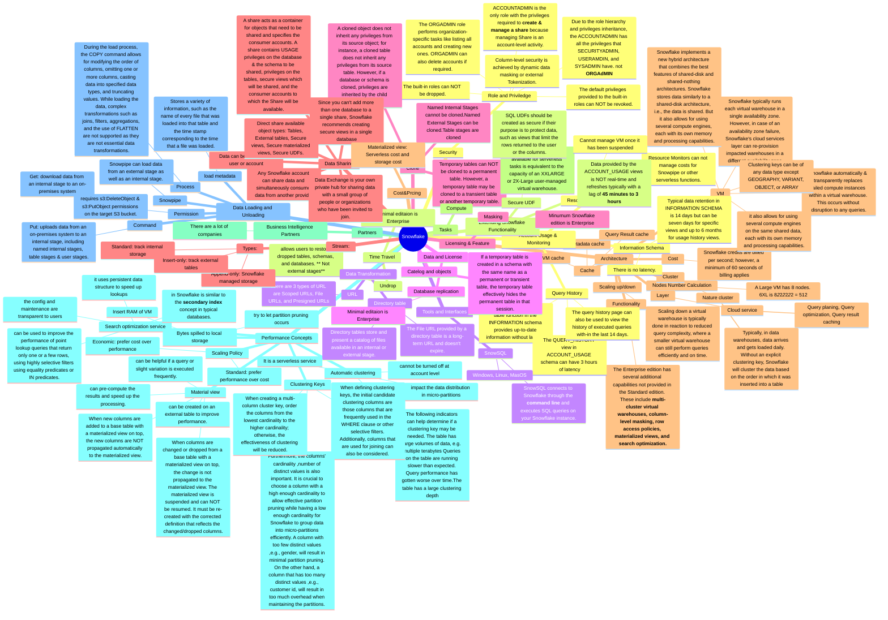

```mermaid
mindmap
 root((Snowflake))

  Security
    Role and Priviledge
      The built-in roles can NOT be dropped.
      The default privileges provided to the built-in roles can NOT be revoked.
      The ORGADMIN role performs organization-specific tasks like listing all accounts and creating new ones. ORGADMIN can also delete accounts if required.
      ACCOUNTADMIN is the only role with the privileges required to **create & manage a share** because managing Share is an account-level activity.
      Due to the role hierarchy and privileges inheritance, the ACCOUNTADMIN has all the privileges that SECURITYADMIN, USERAMDIN, and SYSADMIN have. not **ORGAdMIN**
      Column-level security is achieved by dynamic data masking or external Tokenization.

  Time Travel
    Minimal editaion is Enterprise
    Undrop
      allows users to restore dropped tables, schemas, and databases. ** Not external stages**

  Data Transformation
    Directory table
      The File URL provided by a directory table is a long-term URL and doesn't expire.
      Directory tables store and present a catalog of files available in an internal or external stage.
    URL
      There are 3 types of URL are Scoped URLs, File URLs, and Presigned URLs

  Data and License
    Database replication
      Minimal editaion is Enterprise

  Clone
    Named Internal Stages cannot be cloned.Named External Stages can be cloned.Table stages are cloned
    A cloned object does not inherit any privileges from its source object; for instance, a cloned table does not inherit any privileges from its source table. However, if a database or schema is cloned, privileges are inherited by the child objects.
    Temporary tables can NOT be cloned to a permanent table. However, a temporary table may be cloned to a transient table or another temporary table.

  Data Sharing
    Data can be shared, not user or account
    A share acts as a container for objects that need to be shared and specifies the consumer accounts. A share contains USAGE privileges on the database & the schema to be shared, privileges on the tables, secure views which will be shared, and the consumer accounts to which the Share will be available.
    Any Snowflake account can share data and simultaneously consume data from another provider
    Since you can't add more than one database to a single share, Snowflake recommends creating secure views in a single database
    Direct share available object types: Tables, External tables, Secure views, Secure materialized views, Secure UDFs. 
    Data Exchange is your own private hub for sharing data with a small group of people or organizations who have been invited to join.

  Architecture
    Scaling up/down
      Scaling down a virtual warehouse is typically done in reaction to reduced query complexity, where a smaller virtual warehouse can still perform queries efficiently and on time.
    Cache
      VM cache
      Metadata cache
      Query Result cache
    Cost
      Snowflake credits are billed per second; however, a minimum of 60 seconds of billing applies
    Functionality
      The Enterprise edition has several additional capabilities not provided in the Standard edition. These include **multi-cluster virtual warehouses, column-level masking, row access policies, materialized views, and search optimization.**
    Nodes Number Calculation
      A Large VM has 8 nodes. 6XL is 8*2*2*2*2*2*2 = 512
    VM
      Snowflake automatically & transparently replaces failed compute instances within a virtual warehouse. This occurs without disruption to any queries.
      Snowflake typically runs each virtual warehouse in a single availability zone. However, in case of an availability zone failure, Snowflake's cloud services layer can re-provision impacted warehouses in a different availability zone.
      Clustering keys can be of any data type except GEOGRAPHY, VARIANT, OBJECT, or ARRAY
      it also allows for using several compute engines on the same shared data, each with its own memory and processing capabilities.
      Snowflake implements a new hybrid architecture that combines the best features of shared-disk and shared-nothing architectures. Snowflake stores data similarly to a shared-disk architecture, i.e., the data is shared. But it also allows for using several compute engines, each with its own memory and processing capabilities.
    Layer
      Cloud service
        Query planing, Query optimization, Query result caching
    Cluster
      Nature cluster
        Typically, in data warehouses, data arrives and gets loaded daily. Without an explicit clustering key, Snowflake will cluster the data based on the order in which it was inserted into a table


  Tasks
    Compute
      The largest compute size available for serverless tasks is equivalent to the capacity of an XXLARGE or 2X-Large user-managed virtual warehouse.

  Partners
    Business Intelligence Partners
      There are a lot of companies

  Performance Concepts
    Material view
      can be helpful if a query or slight variation is executed frequently.
      can pre-compute the results and speed up the processing.
      can be created on an external table to improve performance.
      When new columns are added to a base table with a materialized view on top, the new columns are NOT propagated automatically to the materialized view.
      When columns are changed or dropped from a base table with a materialized view on top, the change is not propagated to the materialized view. The materialized view is suspended and can NOT be resumed. It must be re-created with the corrected definition that reflects the changed/dropped columns.
    Search optimization service 
      can be used to improve the performance of point lookup queries that return only one or a few rows, using highly selective filters using equality predicates or IN predicates.
      in Snowflake is similar to the **secondary index** concept in typical databases.
      it uses persistent data structure to speed up lookups
      the config and maintenance are transparent to users
    Scaling Policy
      Economic: prefer cost over performance
      Standard: prefer performance over cost
    Bytes spilled to local storage
      try to let partition pruning occurs
      Insert RAM of VM
    Automatic clustering  
      It is a serverless service
      impact the data distribution in micro-partitions
      cannot be turned off at account level
      The following indicators can help determine if a clustering key may be needed. The table has large volumes of data, e.g. multiple terabytes Queries on the table are running slower than expected. Query performance has gotten worse over time.The table has a large clustering depth
    Clustering Keys
      When defining clustering keys, the initial candidate clustering columns are those columns that are frequently used in the WHERE clause or other selective filters. Additionally, columns that are used for joining can also be considered. 
      Furthermore, the columns' cardinality ,number of distinct values is also important. It is crucial to choose a column with a high enough cardinality to allow effective partition pruning while having a low enough cardinality for Snowflake to group data into micro-partitions efficiently. A column with too few distinct values ,e.g., gender, will result in minimal partition pruning. On the other hand, a column that has too many distinct values ,e.g., customer id, will result in too much overhead when maintaining the partitions. 
      When creating a multi-column cluster key, order the columns from the lowest cardinality to the higher cardinality; otherwise, the effectiveness of clustering will be reduced.


  Data Loading and Unloading
    Command
      Put: uploads data from an on-premises system to an internal stage, including named internal stages, table stages & user stages.
      Get: download data from an internal stage to an on-premises system
    load metadata
      Stores a variety of information, such as the name of every file that was loaded into that table and the time stamp corresponding to the time that a file was loaded.
    Process
      During the load process, the COPY command allows for modifying the order of columns, omitting one or more columns, casting data into specified data types, and truncating values. While loading the data, complex transformations such as joins, filters, aggregations, and the use of FLATTEN are not supported as they are not essential data transformations.
    Snowpipe
      Snowpipe can load data from an external stage as well as an internal stage. 
    Permission
      requires s3:DeleteObject & s3:PutObject permissions on the target S3 bucket.

  Account Usage & Monitoring
    Information Schema
      Typical data retention in INFORMATION SCHEMA is 14 days but can be seven days for specific views and up to 6 months for usage history views.
      There is no latency.
    Query History
      The QUERY_HISTORY table function in the INFORMATION schema provides up-to-date information without latency.
      The QUERY_HISTORY view in ACCOUNT_USAGE schema can have 3 hours of latency
      The query history page can also be used to view the history of executed queries with-in the last 14 days.
    Resource Monitors
      Resource Monitors can not manage costs for Snowpipe or other serverless functions.
      Cannot manage VM once it has been suspended
       
  Extending Snowflake Functionality
      Data provided by the ACCOUNT_USAGE views is NOT real-time and refreshes typically with a lag of **45 minutes to 3 hours**
    Secure UDF
      SQL UDFs should be created as secure if their purpose is to protect data, such as views that limit the rows returned to the user or the columns.

  Tools and Interfaces
    SnowSQL
      Windows, Linux, MasOS
      SnowSQL connects to Snowflake through the **command line** and executes SQL queries on your Snowflake instance.

  Catelog and objects
    If a temporary table is created in a schema with the same name as a permanent or transient table, the temporary table effectively hides the permanent table in that session.

  Licensing & Feature
    Masking
      Minumum Snowflake edition is Enterprise


  Stream:
    Types:
      Standard: track internal storage
      Append-only: Snowflake managed storage
      Insert-only: track external tables
  
  Cost&Prcing
    Materialized view: Serverless cost and storage cost

```
